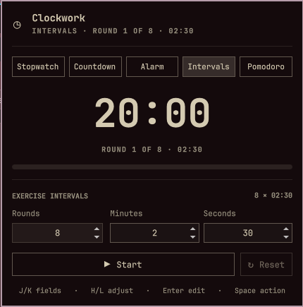

# Clockwork for Omarchy



A compact Omarchy Quattro bar widget with five modes:

- Stopwatch: a regular count-up timer.
- Countdown: minutes and seconds, with an optional full-screen break view and
  editable message.
- Alarm: set a one-shot alarm for the next occurrence of a clock time.
- Intervals: `X` exercise rounds with a minutes-and-seconds duration.
- Pomodoro: alternate configurable focus and short-break phases, followed by a
  long break after the final focus cycle. The bar switches to a green coffee
  indicator during breaks, and the panel tracks completed focus sessions.

The timer keeps running when its panel is closed. Exercise intervals play one
direct PipeWire ping at each round boundary and a three-ping sequence at
completion, while Omarchy notifications show the corresponding round state.
Pomodoro uses the same single ping between phases and three-ping completion;
its sound can be disabled. Breaks start automatically after focus, while the
next focus phase waits for you to resume it.

## Install

```sh
omarchy plugin add https://github.com/shafayetejaman/io.github.pjgeutjens.clockwork.git --enable
```

Update an installed copy with:

```sh
omarchy plugin update io.github.pjgeutjens.clockwork
```

## Local development

Validate the plugin from this repository:

```sh
./scripts/validate.sh
```

Install a local working copy:

```sh
plugin_id=io.github.pjgeutjens.clockwork
plugin_dir="$HOME/.config/omarchy/plugins/$plugin_id"
mkdir -p "$plugin_dir"
rsync -a --delete \
  --exclude .git \
  --exclude .agents \
  --exclude .codex \
  ./ "$plugin_dir/"
omarchy-shell shell rescanPlugins
omarchy plugin enable "$plugin_id"
```

The widget defaults to the right section of the bar. Move it with:

```sh
omarchy bar move io.github.pjgeutjens.clockwork --section right
```

The popup follows the widget's bar position. To place both the widget and its
popup in the center, use:

```sh
omarchy bar move io.github.pjgeutjens.clockwork --section center
```

Left-click opens the panel. Middle-click starts or pauses the active timer;
right-click resets it.

Inside the panel, keyboard navigation has two states:

- In browse mode, `1` through `5` selects Stopwatch, Countdown, Alarm,
  Intervals, or Pomodoro. `J`/`K`, Up/Down, or Tab/Shift+Tab moves through the
  current mode's fields and wraps at either end. `H`/`L` or Left/Right moves
  between the large time segments, adjusts a selected compact number by one,
  or switches the fullscreen option off/on. Enter edits
  the selected number or text, or activates a toggle. Mouse hover moves
  the same visible cursor.
- In edit mode, typing replaces the selected value, Up/Down adjusts a number,
  Enter accepts it, Escape leaves the field, and Tab/Shift+Tab accepts it and
  moves to the next/previous field. Digits are entered into the field instead
  of switching modes.
- Space starts or pauses the active timer, or Sets/Unsets an alarm. `R` resets.
  During a Pomodoro session, `S` skips the current phase without counting a
  skipped focus session.
  These shortcuts work from browse mode. Stopwatch has no settable fields, so
  Tab continues to the adjacent bar panel.

While Countdown or Alarm is idle, its major time segments use the larger edit
controls; interval and Pomodoro sub-settings remain compact. In Countdown mode,
enable **Fullscreen break view** before starting to show the timer and break
message across the current display. The option is off by default. In the
full-screen view, Space pauses or resumes, `Esc` returns to the panel without
stopping the countdown, and `R` ends and resets it.

The timer can also be scripted through Omarchy Shell IPC:

```sh
timer=io.github.pjgeutjens.clockwork
omarchy-shell "$timer" stopwatch
omarchy-shell "$timer" countdown 5 0
omarchy-shell "$timer" intervals 8 2 30
omarchy-shell "$timer" alarm 7 30 "Wake up"
omarchy-shell "$timer" pomodoro 25 5 4 15
omarchy-shell "$timer" start
omarchy-shell "$timer" pause
omarchy-shell "$timer" skip
omarchy-shell "$timer" reset
omarchy-shell "$timer" status
omarchy-shell "$timer" open
omarchy-shell "$timer" close
omarchy-shell "$timer" toggle
```

The interval command accepts `rounds minutes seconds`; the example above sets
eight rounds of 2 minutes 30 seconds. For compatibility, the earlier forms
`intervals 8 30 seconds` and `intervals 8 2 minutes` still work.

## Pomodoro settings

Changes made in the Pomodoro fields and sound toggle are saved to the widget's
entry in `~/.config/omarchy/shell.json`. They can also be set from the command
line:

```sh
omarchy bar set io.github.pjgeutjens.clockwork pomodoroWorkMinutes 25 --json
omarchy bar set io.github.pjgeutjens.clockwork pomodoroShortBreakMinutes 5 --json
omarchy bar set io.github.pjgeutjens.clockwork pomodoroLongBreakMinutes 15 --json
omarchy bar set io.github.pjgeutjens.clockwork pomodoroCycles 4 --json
omarchy bar set io.github.pjgeutjens.clockwork pomodoroSound true --json
omarchy bar set io.github.pjgeutjens.clockwork pomodoroBreakColor '#a6e3a1'
```

For compatibility with standalone Pomodoro conventions, Clockwork also reads
`workMinutes`, `shortBreakMinutes`, `longBreakMinutes`,
`pomodorosPerCycle`, `sound`, and `breakColor` when their namespaced Clockwork
counterparts are absent.

## Dependencies and permissions

Clockwork requires the Omarchy Quattro shell. It invokes the Omarchy-provided
`omarchy-notification-send` command for notifications and PipeWire's `pw-play`
with the freedesktop system sound files for audible alerts. It installs no
packages, starts no daemon, makes no network requests, and requires no secrets
or privileged access.

## Remove the local copy

```sh
omarchy plugin remove io.github.pjgeutjens.clockwork
```

## Runtime notes

This plugin runs inside the long-lived `omarchy-shell` process and starts no
daemon of its own. Its timer state survives closing the panel, but resets when
the shell itself restarts.
